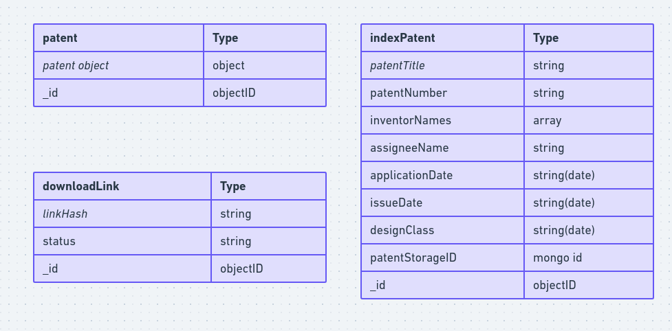
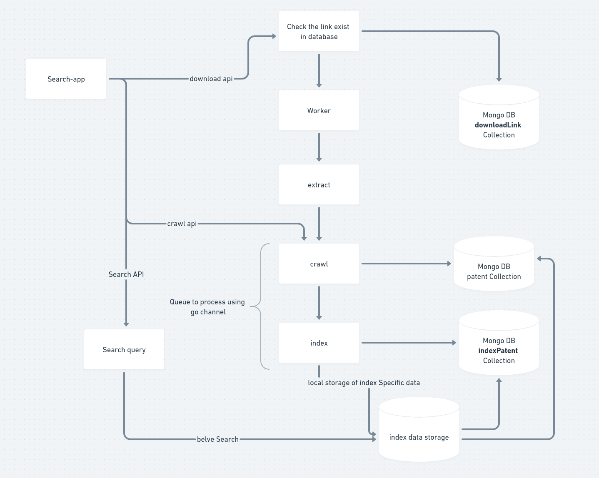

# Patent Search Engine

## Requirements

- **Data Parsing**: The application downloads and parses the USPTO Design Patent dataset, available in XML format. The dataset can be obtained from [USPTO's official site](https://bulkdata.uspto.gov/data/patent/grant/redbook/2023/).

- **Database**: The parsed data is stored efficiently in a MongoDB database, considering performance and scalability.

- **Search Functionality**: Users can search for design patents based on:

  - Patent Title
  - Patent Number
  - Inventor(s) Name
  - Assignee (Owner) Name
  - Application Date
  - Issue Date
  - Design Class (if available)

- **Documentation**: Clear documentation is provided on how to set up and run the search engine, including instructions for downloading and parsing the USPTO Design Patent dataset.

- **Performance Optimization**: Optimizations have been implemented to ensure efficient performance, even with a large dataset.

## Data Model and System Design

The system is designed to be scalable and efficient in handling large datasets. The data model is structured to optimize the storage and retrieval of patent data. Below is a link to the system design and data model diagram:





## Getting Started

### Prerequisites

- GoLang installed on your machine.
- Docker and Docker Compose installed on your machine.
- Access to the USPTO Design Patent dataset.

### Setup and Running

1. **Clone the Repository**:

---

```sh
   cd search-app
```

---

**Run the Project using Docker Compose**:

---

```sh
   make all
```

---

2. **Build the Database Docker Image and Start the Database Services**:

---

```sh
   make build-db
```

---

3. **Build the Project**:

---

```sh
   make build
```

---

4. **Run Tests**:

---

```sh
   make test
```

---

5. **Run the Project using Docker Compose**:

---

```sh
   make all
```

---

6. **View Logs**:

---

```sh
   make docker-log
```

---

7. **Clean Up**:

---

```sh
   make clean
```

---

8. **Stop the Docker Compose Services**:

---

```sh
   make docker-compose-down
```

---

## sample Data

Sample data is available in the [sample-data](https://bitly.ws/W7f4) link. The data is in XML format, and can be imported into the database using the following command:

---

```sh
curl --location --request GET 'http://localhost:40051/api/v1/download?link=https%3A%2F%2Fbitly.ws%2FW7f4' \
--header 'Content-Type: application/json' \
--data '{


}'

```

---

## sample Search

Sample search api is for patent number 11696523

---

```sh
curl --location 'http://127.0.0.1:40051/api/v1/search?query=11696523'
```

---

## Documentation

For a detailed guide on how to use the search engine, including endpoints and example requests, refer to the provided Postman documentation available at [api.html](api.html).
